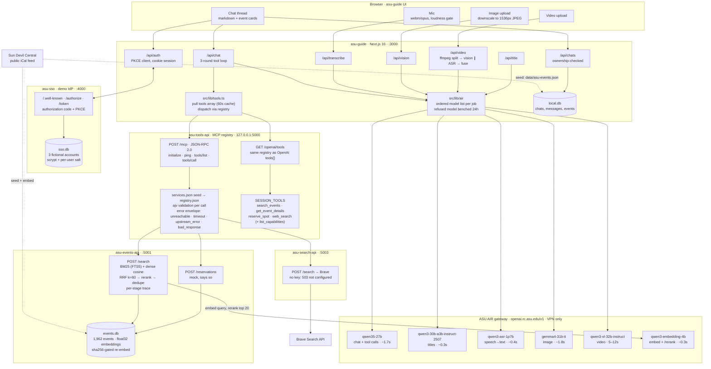

# ASU Guide — Spark Challenge 2026

A campus assistant built on the **ASU AI Research Acceleration Platform (AIR)**.
Team **InnovatAIRs** · ASU AIR Spark Challenge, Sept 2–4 2026.

Every model call in this project runs on ASU's own self-hosted open-weight
models via `https://openai.rc.asu.edu/v1` (Intel Gaudi nodes on Sol). No
external AI vendor is used at runtime.

## Apps

| Path              | Port | What it is                                                                           |
| ----------------- | ---- | ------------------------------------------------------------------------------------ |
| `asu-guide/`      | 3000 | The assistant — chat with a tool loop, voice, image, video, saved conversations      |
| `asu-sso/`        | 4000 | A **mock** OAuth 2.0 + PKCE identity provider, so sign-in is a real handshake        |
| `asu-tools-api/`  | 5000 | MCP tool registry + dispatch; also renders the registry as an OpenAI `tools` array   |
| `asu-events-api/` | 5001 | Hybrid BM25 + dense retrieval over the events, mock RSVPs                            |
| `asu-search-api/` | 5003 | Optional Brave web search. Without a key it answers "not configured", nothing breaks |

## Architecture



**One turn, end to end.** A signed-in student types _"reserve me a spot for the first one"_. `/api/chat` reads the ASURITE from the server session, pulls the four session tools from the registry, and sends the thread to `qwen35-27b`. The model calls `reserve_spot` with a guessed id; the registry validates the arguments, dispatches to `asu-events-api`, and returns a structured error. The model reads it, calls `search_events` to recover the real id, then `reserve_spot` again — three tool calls in one turn, all through the same validation layer. Specialist outputs (a flyer photo, a voice note) are folded back into the thread as text, so the chat model can answer "what time was that again?" several turns later.

## What it does

- **Campus events** — 1,962 real upcoming events from the public Sun Devil
  Central iCal feed. No login, no personal data, no scraping behind auth.
- **Voice input** — record in the browser, transcribed by `qwen3-asr-1p7b` in
  ~0.4s. webm/opus goes straight to the gateway; no transcode.
- **Images** — `gemma4-31b-it` (~1.8s), downscaled client-side first because the
  gateway rejects bodies over roughly 3MB of base64.
- **Video** — ffmpeg splits the clip; `qwen3-vl-32b-instruct` watches it while
  `qwen3-asr-1p7b` listens, and a third model fuses the two. Audio is checked
  for actual signal first: ASR models invent text from silence.
- **Conversation titles** — named by `qwen3-30b-a3b-instruct-2507` (~0.3s).
- **Model fallback** — every service has an ordered model list. A model the
  gateway _refuses_ is benched for 24h; a model that is merely _slow_ is not.
  See `src/lib/air/`.
- **Sign in** — real authorization-code flow with PKCE against `asu-sso`.

## Running it

Requires the **ASU VPN** (the AIR gateway is not reachable off-network) and an
API key from `voyager.rc.asu.edu` → AI LLM → Create Key.

```bash
./install.sh   # checks node/pnpm/ffmpeg, asks for the key, tests the VPN, installs, seeds
./dev.sh       # starts all five services in one terminal; Ctrl-C stops them
```

`install.sh` is interactive and idempotent. It reuses `RC_OPENAI_API_KEY` and
`BRAVE_API_KEY` if they are already in your shell, writes `./.env`,
`asu-guide/.env.local` and `asu-search-api/.env` (all gitignored), installs with
pnpm (npm if pnpm is missing), then seeds both SQLite databases. The events
embedding pass needs the VPN; off-VPN it seeds BM25-only and says so. Brave is
optional — skip it and web search reports "not configured". `./install.sh --yes`
never prompts.

Manual equivalent, per service: `pnpm install` then `pnpm dev` in each folder;
`pnpm db:push && pnpm db:seed` in `asu-guide`, `pnpm seed` in `asu-events-api`.

`ffmpeg` must be on PATH for video (`brew install ffmpeg`); everything else
works without it.

## Notes

- Chat is a real model (`qwen35-27b`) calling real tools through `asu-tools-api`
  — `search_events`, `get_event_details`, `reserve_spot`, `web_search`. Nothing
  is scripted. Reservations are mock and say so in the response.
- `asu-sso` is a **demo** identity provider with three fictional, locally seeded
  accounts (`admin`/`admin`, `sundevil`/`sundevil`, `asirajud`/`sparkdemo`).
  Passwords are verified (scrypt). Its client credentials are fake and committed
  on purpose. It is not, and must not become, an ASU login.
- Data: public event listings only. No student records — ASU AIR's terms forbid
  sending regulated data or PII to the gateway. See `docs/PRIVACY-AND-MEMORY.md`
  for the memory/personalisation design and where that line sits.
- `docs/AIR-BUILD-LOG-*.md` record which AIR model wrote which file during the
  builds that were authored through `opencode`.
